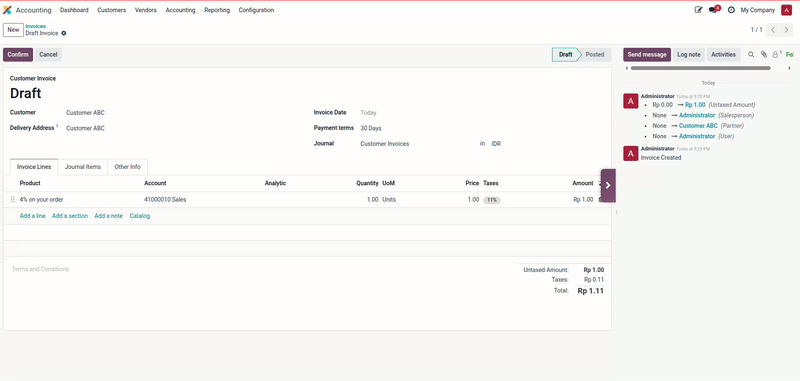

# Flexible Chatter for Odoo 18

A powerful Odoo module that enhances the chatter experience with flexible positioning, resizable width, message pinning, and fullscreen mode capabilities.

## 📹 Demo

## ✨ Features

### 📍 Flexible Chatter Position
Choose where to display the chatter on form views:
- **Auto** - Default Odoo behavior (responsive)
- **Sided** - Always display chatter on the right side
- **Bottom** - Always display chatter at the bottom

### ↔️ Resizable Chatter Width
When using "Sided" position:
- Drag the left edge of the chatter to resize
- Width is saved per user in browser localStorage
- Minimum width: 300px, Maximum width: 800px

### 🖥️ Hide/Show Chatter (Fullscreen Mode)
Toggle chatter visibility for maximum form space:
- **Toggle Button** - Purple button on the right edge of chatter
- **Fullscreen Mode** - Hide chatter to use full screen width for form
- **Auto Remember** - Setting applies to ALL form views automatically
- **One-Click Toggle** - Click to hide, click again to show
- **Visual Feedback** - Smooth animation and toast notification

### 📌 Message Pinning
Pin important messages to keep them at the top of the chatter:
- **Pin Button** - Appears on hover at the top-right corner of each message
- **Visual Indicator** - Pinned messages have blue background, border, and "PINNED" badge
- **Auto Reorder** - Pinned messages automatically move to the top
- **Restore Position** - Unpinned messages return to their original chronological position
- **Persistent** - Pin state is saved in browser localStorage
- **Notifications** - Toast notifications when pinning/unpinning

### 🔄 Real-time Tracking Updates
- New tracking messages appear automatically without page reload
- Pin buttons are added to new messages instantly
- Works seamlessly with Odoo's tracking fields

## 📸 Screenshots

| Chatter Position Settings | Message Pinning |
|:-------------------------:|:---------------:|
|  |  |

| Fullscreen Mode | User Profile Settings |
|:---------------:|:---------------------:|
|  |  |

## 🔧 Installation

1. Copy the `sm_flexible_chatter` folder to your Odoo addons directory
2. Update the addons list in Odoo
3. Install the module from Apps menu

## ⚙️ Configuration

### User Settings

Each user can configure their preferred chatter position:

1. Go to **Settings → Users & Companies → Users**
2. Select a user
3. In the **Preferences** tab, find **Chatter Position**
4. Choose: Auto, Sided, or Bottom
5. Save and refresh the page

### Default Setting

The default chatter position is "Sided" for the best experience with all features.

## 🚀 Usage

### Setting Chatter Position

1. Click on your profile (top-right corner)
2. Go to **My Profile** or **Preferences**
3. Find **Chatter Position** field
4. Select your preferred position
5. Save and refresh

### Resizing Chatter

1. Set chatter position to "Sided"
2. Open any form view (Sales Order, Invoice, etc.)
3. Hover over the left edge of the chatter - cursor changes to resize cursor
4. Click and drag to resize
5. Width is automatically saved

### Using Fullscreen Mode

1. Set chatter position to "Sided"
2. Open any form view
3. Look for the **purple toggle button** on the right edge of the chatter
4. Click to **hide chatter** - form expands to full width
5. Click again to **show chatter** - form returns to normal
6. Setting is **remembered globally** - all form views will use the same state

### Pinning Messages

1. Open any record with chatter (Sales Order, Invoice, Contact, etc.)
2. Hover over any message - a **blue pin icon** appears at the top-right corner
3. Click the pin icon to **pin the message** - it moves to the top with blue styling
4. Click the pin icon again to **unpin** - message returns to original position
5. Pins are saved automatically and persist across browser sessions

## 🎯 Compatibility

### Odoo Versions
- ✅ **Odoo 18.0** - Fully tested and supported
- ✅ **Odoo 17.0** - Compatible (OWL framework)
- ⚠️ **Odoo 16.0** - May require minor adjustments
- ❌ **Odoo 15.0 and below** - Not compatible (requires major rewrite)

### Odoo Editions
- ✅ **Community Edition** - Fully supported
- ✅ **Enterprise Edition** - Fully supported

**Why it works on both editions:**
- Only depends on `web` and `mail` modules (available in both editions)
- Uses DOM manipulation and CSS (no model/view overrides)
- Pure JavaScript with localStorage (no backend dependencies)

## 🛠️ Technical Details

### Architecture
The module uses:
- **OWL Framework** - Patches FormController and FormCompiler
- **DOM Manipulation** - Direct element creation and positioning
- **MutationObserver** - Detects new messages from tracking updates
- **localStorage** - Persists user preferences

### Dependencies
- `web` - Core web framework
- `mail` - Chatter functionality

### Browser Storage
The module uses `localStorage` to persist:
- Chatter width preference (`sm_chatter_width`)
- Pinned message states (`sm_pinned_msg_{messageId}`)
- Fullscreen mode state (`sm_chatter_fullscreen`)

### Browser Requirements
- Modern browsers with ES6+ support
- Chrome 90+, Firefox 88+, Edge 90+, Safari 14+
- JavaScript enabled
- localStorage enabled

## 💰 Pricing

**Special Launch Offer: $250**

Get all powerful features at an exclusive price! Coming soon to the Odoo Apps Store.

## 🗺️ Roadmap

### Future Versions
- **Version 17.0.1.0.0** - Port to Odoo 17 (planned)
- **Version 16.0.1.0.0** - Port to Odoo 16 (planned)

**Note**: Odoo 15.0 and below are not planned due to different architecture (Widget-based vs OWL framework)

## 📝 Changelog

### 18.0.1.0.0 (2025-12-03)
- Initial release for Odoo 18.0
- Flexible chatter positioning (Auto/Sided/Bottom)
- Resizable chatter width with drag handle
- Message pinning with visual indicators
- Real-time tracking field updates without page reload
- Hide/Show chatter toggle for fullscreen mode
- Persistent settings across browser sessions
- Toast notifications for user actions
- Compatible with both Community and Enterprise editions

## 🐛 Bug Tracker

Bugs are tracked on [GitHub Issues](https://github.com/stevenmarp/odoo-modules/issues).

In case of trouble, please check there if your issue has already been reported. If you spotted it first, help us by providing detailed feedback.

## 👥 Credits

### Authors
- **Stevenmarp**

### Contributors
- Steven Marpaung

### Maintainer

This module is maintained by **Stevenmarp**.

For support and more information, please visit:
- Website: https://apps.odoo.com/apps/browse?repo_maintainer_id=512936
- Email: stevenoctavianusmarpaung@gmail.com
- Apps Store: https://apps.odoo.com/apps/browse?repo_maintainer_id=512936

## 📄 License

This module is licensed under [LGPL-3.0](LICENSE).

---

<strong>Made with ❤️ by Stevenmarp</strong>

